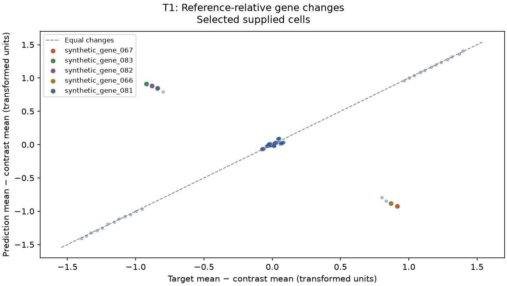
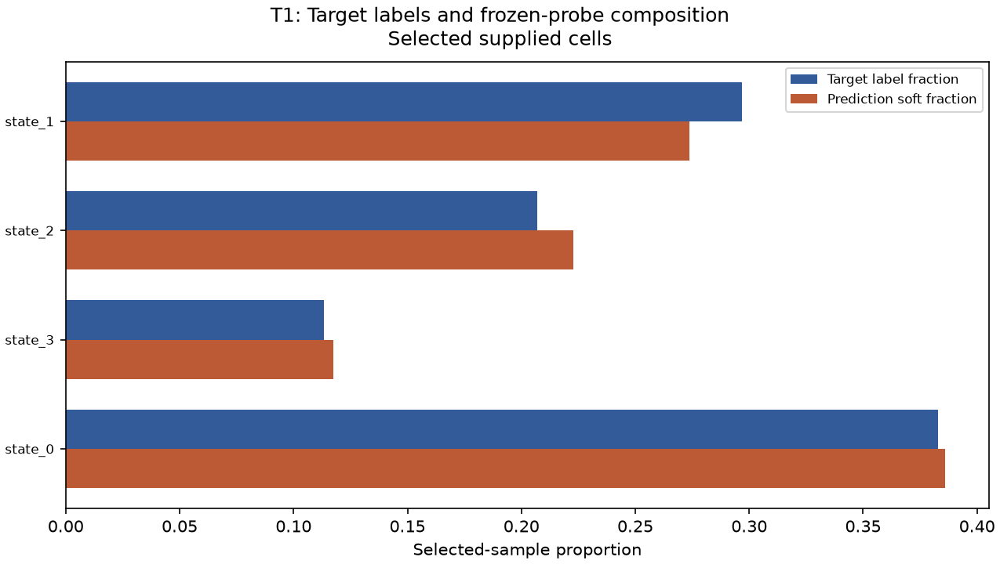
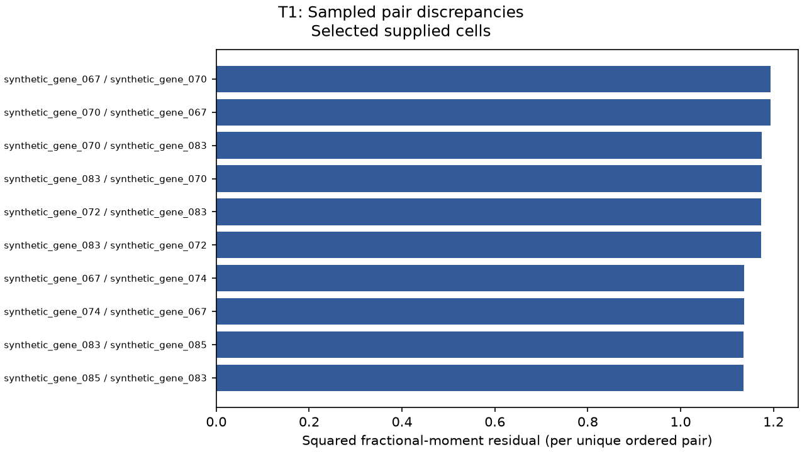

# VEC ScoreLens T1 private diagnostic report — selected subset

> Synthetic public layout example. JSON and CSV ledgers are omitted from this display copy; a full locally generated report includes them.

This report may identify supplied data. Keep it private and do not treat selected-subset results as full-file certification.

## Diagnostic follow-up priorities

Assessment: **thresholds exceeded**. Coverage: listed rules evaluated.
These explicit heuristic conventions order diagnostic follow-up. They are not statistically calibrated, have no guaranteed false-alarm rate or FDR, and do not establish biological health or expected model improvement.
Profile: scorelens\-diagnostic\-conventions\-v1. At most 6 findings are displayed in fixed domain order; all evaluated thresholds are recorded in diagnostics.json.

### 1. Meaningful literal response reversals

Evidence A; selected supplied cells. Triggered rows: 8.
Inspect named gene contrasts, input alignment, and normalization; operational target DE is not confirmed biological regulation.
| entity | measured_value | comparator | threshold | units |
| --- | --- | --- | --- | --- |
| synthetic\_gene\_067 | \-0.920843 | opposite sign and absolute predicted delta &gt; | 0.25 | supplied transformed expression |
| synthetic\_gene\_083 | 0.91332 | opposite sign and absolute predicted delta &gt; | 0.25 | supplied transformed expression |
| synthetic\_gene\_082 | 0.882759 | opposite sign and absolute predicted delta &gt; | 0.25 | supplied transformed expression |
| synthetic\_gene\_066 | \-0.881197 | opposite sign and absolute predicted delta &gt; | 0.25 | supplied transformed expression |
| synthetic\_gene\_081 | 0.844938 | opposite sign and absolute predicted delta &gt; | 0.25 | supplied transformed expression |

### 2. Large selected\-sample mean residuals

Evidence A; selected supplied cells. Triggered rows: 8.
Inspect named gene means, input alignment, normalization, and the supplied target/reference contrast.
| entity | measured_value | comparator | threshold | units |
| --- | --- | --- | --- | --- |
| synthetic\_gene\_067 | 1.83718 | &gt; | 0.25 | supplied transformed expression |
| synthetic\_gene\_083 | 1.83383 | &gt; | 0.25 | supplied transformed expression |
| synthetic\_gene\_082 | 1.76419 | &gt; | 0.25 | supplied transformed expression |
| synthetic\_gene\_066 | 1.74934 | &gt; | 0.25 | supplied transformed expression |
| synthetic\_gene\_081 | 1.68443 | &gt; | 0.25 | supplied transformed expression |

Coverage exclusions:
- pair\_priority: Sampled variogram and descriptive covariance remain evidence tables without an adopted priority threshold.
- sensitivity\_priority: Target\-aware sensitivity is noncausal and does not determine follow\-up priority.
Within listed thresholds means only that evaluated listed rules did not trigger on supplied selected cells. Undefined evidence and unassessed domains remain explicit; this is not a full-file all-clear.

## Assessed input scope

The supplied ordered gene panel and independently selected cells are assessed. The contrast is the supplied reference; equal cell counts do not create paired cells.

| input | original_cells | selected_cells |
| --- | --- | --- |
| prediction | 960 | 256 |
| target | 960 | 256 |
| reference | 960 | 256 |

## Official score output

The values below are the supplied official score output for the selected subset. They are different scales and definitions, so this report intentionally does not label any one metric the ‘weakest’. 
| metric | value |
| --- | --- |
| de\_score | 0.7241 |
| de\_direction | 0.6961 |
| energy\_distance | 2.60042 |
| mmd\_u | 0.04972 |
| variogram | 0.022532 |
| pb\_rel\_err | 0.0999 |
| library\_size\_ratio | 0.996 |
| variance\_ratio | 1.008 |
| composition\_JSD | 0.0006 |
| pseudobulk\_pearson | 0.7663 |
| \_de\_raw | 0.75 |
| \_de\_chance | 0.0938 |
| \_de\_chance\_unif | 0.25 |
| \_n\_up | 16 |
| \_n\_dn | 16 |

## Concrete gene follow-up

Genes below have the largest defined per-gene pseudobulk squared residuals in the selected data. Check their input alignment, normalization, and target/reference contrast before changing a model.
A — direct selected-sample evidence. `change_truth` is target mean minus supplied reference mean; `change_pred` is prediction mean minus supplied reference mean, in supplied transformed expression units.
| gene | change_truth | change_pred | absolute_error | squared_error | truth_de_direction | pred_local_de_direction | official_slot_hit |
| --- | --- | --- | --- | --- | --- | --- | --- |
| synthetic\_gene\_067 | 0.916333 | \-0.920843 | 1.83718 | 3.37522 | up | down | False |
| synthetic\_gene\_083 | \-0.920506 | 0.91332 | 1.83383 | 3.36292 | down | up | False |
| synthetic\_gene\_082 | \-0.881429 | 0.882759 | 1.76419 | 3.11236 | down | up | False |
| synthetic\_gene\_066 | 0.86814 | \-0.881197 | 1.74934 | 3.06018 | up | down | False |
| synthetic\_gene\_081 | \-0.839495 | 0.844938 | 1.68443 | 2.83731 | down | up | False |

Local significant-set hit/miss/false-positive fields and literal mean-log-expression signs are diagnostic aids. A false-positive means a prediction-only local DE call, not a known biological false response or an FDR conclusion; target nonsignificance does not mean no change. These fields are not the official target-sized ranked slots or official partial rank correlation. Rank-based direction can change with float32 roundoff near zero shifts; tiny literal sign differences are not evidence of a meaningful response.
Pseudobulk allocation reconciliation error: 9.67196e\-10. Guard state: none.
Target local DE calls: 16 up and 16 down; local signed matches 24, misses 8, and prediction-only calls 8. Target rank-slot hits with a wrong literal sign: 0.
Distribution variance-ratio evidence (selected supplied cells): 1.00775. A low value is descriptive collapse evidence, not a biological conclusion.

## Concrete composition follow-up

Classes below have the largest defined target-versus-probe soft-proportion deltas. Inspect target labels and probe-domain fit; prediction labels are intentionally not used. Bounded sampling can omit rare classes, and a low predicted proportion is not biological absence.
| celltype | target_fraction | pred_soft_fraction | proportion_error | jsd_term |
| --- | --- | --- | --- | --- |
| state\_1 | 0.296875 | 0.273811 | \-0.0230636 | 0.000336274 |
| state\_2 | 0.207031 | 0.222815 | 0.0157833 | 0.000209074 |
| state\_3 | 0.113281 | 0.11745 | 0.00416911 | 2.71785e\-05 |
| state\_0 | 0.382812 | 0.385924 | 0.0031113 | 4.54019e\-06 |
JSD term reconciliation error: 2.1684e\-19.

## Sampled variogram and descriptive covariance follow-up

These rows aggregate sampled ordered pairs (duplicates retained as occurrences). Variogram errors are sampled fractional-moment errors; covariance residuals are descriptive companion columns, not a claim that variogram is pure covariance. Covariance uses population ddof=0 on the supplied transformed values, so its units follow those values rather than a biological scale.
| gene_i | gene_j | sampled_occurrences | variogram_squared_error | covariance_error |
| --- | --- | --- | --- | --- |
| synthetic\_gene\_067 | synthetic\_gene\_070 | 2 | 1.1933 | \-0.000587924 |
| synthetic\_gene\_070 | synthetic\_gene\_067 | 1 | 1.1933 | \-0.000587924 |
| synthetic\_gene\_070 | synthetic\_gene\_083 | 2 | 1.17452 | \-0.000182736 |
| synthetic\_gene\_083 | synthetic\_gene\_070 | 4 | 1.17452 | \-0.000182736 |
| synthetic\_gene\_072 | synthetic\_gene\_083 | 2 | 1.17367 | 0.00152802 |
Sampled pair count: 19836; unique ordered pairs: 11434; reconciliation error: 6.59371e\-10.
Possible ordered nonself pairs: 16256; unique ordered-pair coverage fraction: 0.703371. Coverage is of ordered nonself pairs, not modules. Unsampled pairs have no diagnostic evidence; a small gene module may have no sampled within\-module pair even when every gene appears somewhere.

## MMD sensitivity (noncausal)

One nonnegative-clipped target mean-shift sensitivity was run: before 0.0497227, after 0.0129458, change \-0.0367768; affected genes: synthetic\_gene\_067, synthetic\_gene\_083, synthetic\_gene\_082, synthetic\_gene\_066, synthetic\_gene\_081.
The listed delta is after minus before. This target-aware, selected-and-evaluated-on-the-same-target artificial diagnostic is not a validated model correction, causal or additive attribution, percent contribution, or expected training improvement; it can worsen the score.

## Measured figures

A — defined: Per\-gene measured mean changes. Contrast is the supplied reference (T1/T2) or matched WT (T3). Named genes have the largest literal change residuals; these are not biological importance rankings.

A — defined: Up to 12 classes with largest measured soft\-fraction gaps. Prediction labels are ignored. A low predicted fraction is not biological absence; omitted classes remain explicit report warnings.

B — defined: Largest measured unique ordered\-pair residuals. Official reconciliation uses retained occurrence weights, not the displayed unweighted bar heights. Covariance remains separate descriptive evidence, not regulatory interaction.

## Evidence taxonomy and limits

A: direct or algebraic selected-sample evidence; B: sampled evidence; C: artificial noncausal sensitivity; D: descriptive companion statistics. Exact/direct does not mean exact biology. Gene and composition calculations are exact for the bounded selected cells and supplied probe within stated numerical reconciliation tolerance; pair calculations are sampled. The source-provided gene panel is used as supplied and this report is not an official leaderboard or board-validation result. The selected subset is explicitly not evidence of full-file equivalence. Probe labels are limited to its domain, so a low predicted proportion is not biological absence. Variogram/covariance diagnostics do not establish gene regulation. Any max-dense input limit controls selected input conversion only; it is not a total process peak-memory guarantee.

## Warnings

- All scores and diagnostics apply to the selected supplied\-cell subset; they do not certify unscanned original rows.
- Biological states are assessed only through global gene errors and frozen\-probe proportions; no state\-conditional expression attribution is computed.
- The target\-informed matrix edit is noncausal sensitivity and may alter normalization.
- Runtime FutureWarning: 'n\_jobs' has no effect since 1.8 and will be removed in 1.10. You provided 'n\_jobs=\-1', please leave it unspecified.
- Null values in this report mean undefined, not applicable, or non\-finite input values; see each diagnostic definition and limitation for its reason.
