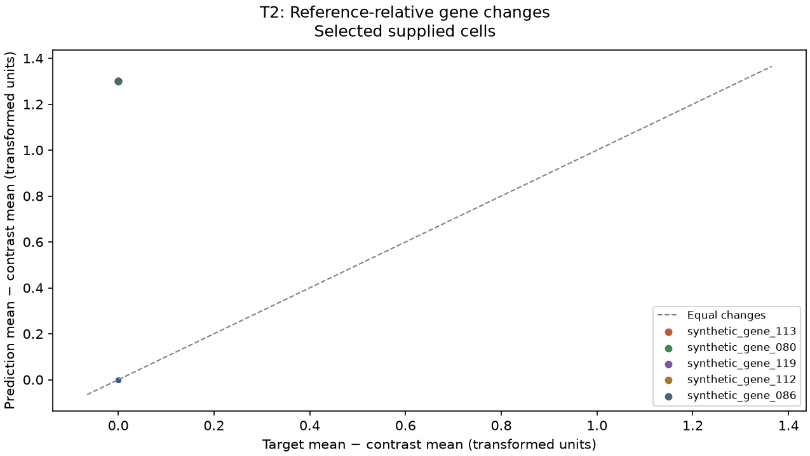
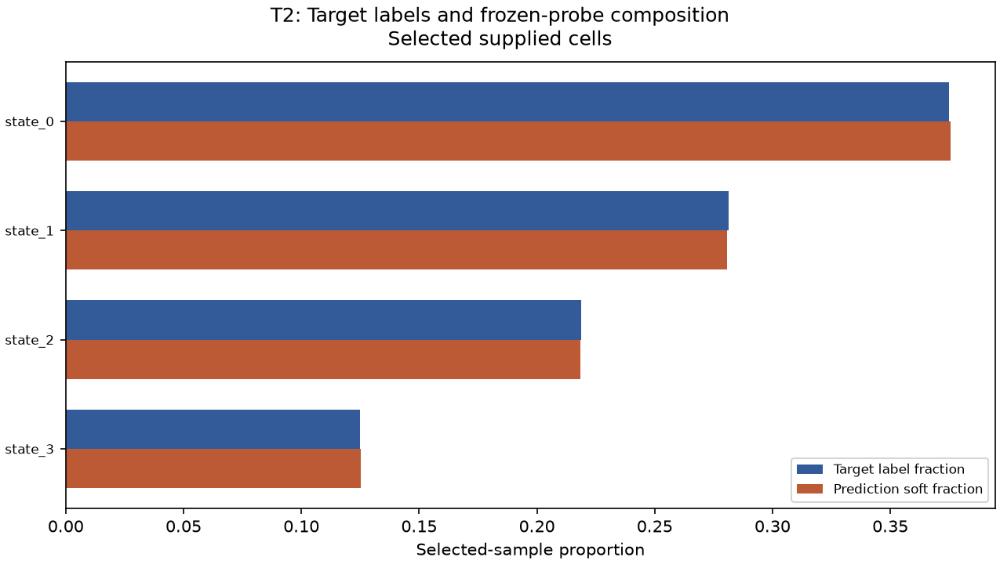
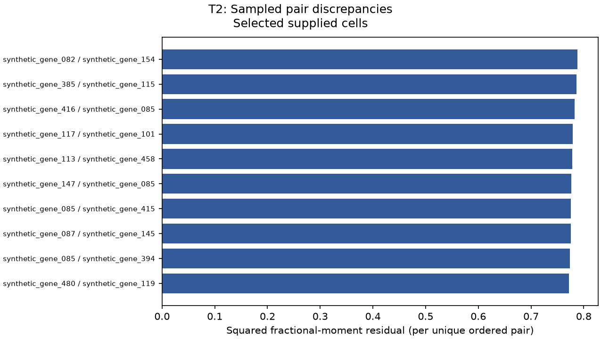
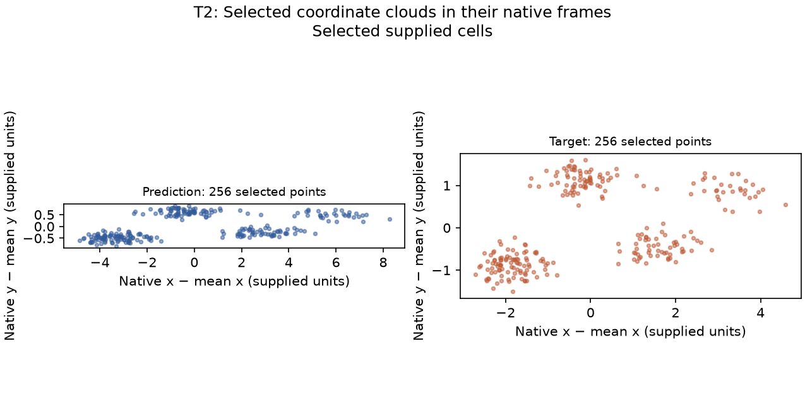
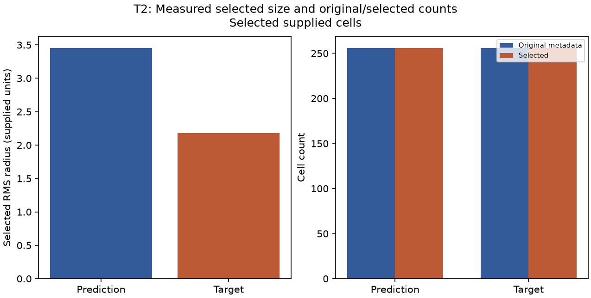

# VEC ScoreLens T2 private diagnostic report — selected subset

> Synthetic public layout example. JSON and CSV ledgers are omitted from this display copy; a full locally generated report includes them.

This report may identify supplied data. Keep it private and do not treat selected-subset results as full-file certification.

## Diagnostic follow-up priorities

Assessment: **thresholds exceeded**. Coverage: listed rules evaluated.
These explicit heuristic conventions order diagnostic follow-up. They are not statistically calibrated, have no guaranteed false-alarm rate or FDR, and do not establish biological health or expected model improvement.
Profile: scorelens\-diagnostic\-conventions\-v1. At most 6 findings are displayed in fixed domain order; all evaluated thresholds are recorded in diagnostics.json.

### 1. Large selected\-sample mean residuals

Evidence A; selected supplied cells. Triggered rows: 16.
Inspect named gene means, input alignment, normalization, and the supplied target/reference contrast.
| entity | measured_value | comparator | threshold | units |
| --- | --- | --- | --- | --- |
| synthetic\_gene\_113 | 1.3 | &gt; | 0.25 | supplied transformed expression |
| synthetic\_gene\_080 | 1.3 | &gt; | 0.25 | supplied transformed expression |
| synthetic\_gene\_119 | 1.3 | &gt; | 0.25 | supplied transformed expression |
| synthetic\_gene\_112 | 1.3 | &gt; | 0.25 | supplied transformed expression |
| synthetic\_gene\_086 | 1.3 | &gt; | 0.25 | supplied transformed expression |

### 2. Selected coordinate size discrepancy

Evidence D; selected supplied cells. Triggered rows: 1.
Inspect coordinate units and selected\-cloud size. This comparison does not establish biological growth.
| entity | measured_value | comparator | threshold | units |
| --- | --- | --- | --- | --- |
| selected RMS radius | 0.461538 | &gt; | 0.223144 | absolute selected log RMS\-radius ratio |

Coverage exclusions:
- shape\_and\_local\_priority: Shape and local organization are measured separately but have no adopted priority thresholds; SW/Dice have a source\-frame caveat.
- laterality: No calibrated anatomical laterality diagnostic is computed.
- pair\_priority: Sampled variogram and descriptive covariance remain evidence tables without an adopted priority threshold.
- sensitivity\_priority: Target\-aware sensitivity is noncausal and does not determine follow\-up priority.
Within listed thresholds means only that evaluated listed rules did not trigger on supplied selected cells. Undefined evidence and unassessed domains remain explicit; this is not a full-file all-clear.

## Assessed input scope

The supplied ordered gene panel and independently selected cells are assessed. The contrast is the supplied reference; equal cell counts do not create paired cells.

| input | original_cells | selected_cells |
| --- | --- | --- |
| prediction | 256 | 256 |
| target | 256 | 256 |
| reference | 256 | 256 |

## Official score output

The values below are the supplied official score output for the selected subset. They are different scales and definitions, so this report intentionally does not label any one metric the ‘weakest’. 
| metric | value |
| --- | --- |
| de\_score | null (undefined/not applicable) |
| de\_direction | 0.9334 |
| energy\_distance | 1.96846 |
| mmd\_u | 0.00189 |
| variogram | 0.025676 |
| d2\_shape | 0.14109 |
| sliced\_wasserstein | 0.13164 |
| occupancy\_dice | 0.2727 |
| scale\_log\_ratio | 0.4615 |
| count\_log\_ratio | 0 |
| neighborhood\_mmd | 0.22098 |
| pb\_rel\_err | 0.038 |
| library\_size\_ratio | 1.058 |
| variance\_ratio | 1 |
| composition\_JSD | 0 |
| pseudobulk\_pearson | 0.7569 |
| morans\_I\_agreement | 0.7542 |
| \_de\_raw | null (undefined/not applicable) |
| \_de\_chance | null (undefined/not applicable) |
| \_n\_up | 0 |
| \_n\_dn | 0 |
| \_sw\_flip\_spread | 0.09271 |
| \_dice\_voxel\_over\_nn | 5.5 |

## Concrete gene follow-up

Genes below have the largest defined per-gene pseudobulk squared residuals in the selected data. Check their input alignment, normalization, and target/reference contrast before changing a model.
A — direct selected-sample evidence. `change_truth` is target mean minus supplied reference mean; `change_pred` is prediction mean minus supplied reference mean, in supplied transformed expression units.
| gene | change_truth | change_pred | absolute_error | squared_error | truth_de_direction | pred_local_de_direction | official_slot_hit |
| --- | --- | --- | --- | --- | --- | --- | --- |
| synthetic\_gene\_113 | \-4.76837e\-06 | 1.3 | 1.3 | 1.69001 | none | up | False |
| synthetic\_gene\_080 | \-3.33786e\-06 | 1.3 | 1.3 | 1.69001 | none | up | False |
| synthetic\_gene\_119 | 4.76837e\-07 | 1.3 | 1.3 | 1.69001 | none | up | False |
| synthetic\_gene\_112 | 0 | 1.3 | 1.3 | 1.69001 | none | up | False |
| synthetic\_gene\_086 | \-4.76837e\-07 | 1.3 | 1.3 | 1.69001 | none | up | False |

Local significant-set hit/miss/false-positive fields and literal mean-log-expression signs are diagnostic aids. A false-positive means a prediction-only local DE call, not a known biological false response or an FDR conclusion; target nonsignificance does not mean no change. These fields are not the official target-sized ranked slots or official partial rank correlation. Rank-based direction can change with float32 roundoff near zero shifts; tiny literal sign differences are not evidence of a meaningful response.
Pseudobulk allocation reconciliation error: 1.29025e\-10. Guard state: undefined\_no\_truth\_de.
Target local DE calls: 0 up and 0 down; local signed matches 0, misses 0, and prediction-only calls 16. Target rank-slot hits with a wrong literal sign: 0.
Distribution variance-ratio evidence (selected supplied cells): 1. A low value is descriptive collapse evidence, not a biological conclusion.

## Concrete composition follow-up

Classes below have the largest defined target-versus-probe soft-proportion deltas. Inspect target labels and probe-domain fit; prediction labels are intentionally not used. Bounded sampling can omit rare classes, and a low predicted proportion is not biological absence.
| celltype | target_fraction | pred_soft_fraction | proportion_error | jsd_term |
| --- | --- | --- | --- | --- |
| state\_0 | 0.375 | 0.375695 | 0.000694811 | 2.31668e\-07 |
| state\_1 | 0.28125 | 0.280776 | \-0.000474125 | 1.44295e\-07 |
| state\_2 | 0.21875 | 0.218452 | \-0.000298023 | 7.31907e\-08 |
| state\_3 | 0.125 | 0.125077 | 7.70837e\-05 | 8.6856e\-09 |
JSD term reconciliation error: 0.

## Sampled variogram and descriptive covariance follow-up

These rows aggregate sampled ordered pairs (duplicates retained as occurrences). Variogram errors are sampled fractional-moment errors; covariance residuals are descriptive companion columns, not a claim that variogram is pure covariance. Covariance uses population ddof=0 on the supplied transformed values, so its units follow those values rather than a biological scale.
| gene_i | gene_j | sampled_occurrences | variogram_squared_error | covariance_error |
| --- | --- | --- | --- | --- |
| synthetic\_gene\_082 | synthetic\_gene\_154 | 1 | 0.787766 | 1.00967e\-10 |
| synthetic\_gene\_385 | synthetic\_gene\_115 | 1 | 0.786177 | 1.22972e\-09 |
| synthetic\_gene\_416 | synthetic\_gene\_085 | 1 | 0.782636 | \-1.13939e\-09 |
| synthetic\_gene\_117 | synthetic\_gene\_101 | 1 | 0.779124 | \-1.31812e\-09 |
| synthetic\_gene\_113 | synthetic\_gene\_458 | 1 | 0.778038 | \-2.02726e\-10 |
Sampled pair count: 19962; unique ordered pairs: 19213; reconciliation error: 4.07642e\-10.
Possible ordered nonself pairs: 249500; unique ordered-pair coverage fraction: 0.077006. Coverage is of ordered nonself pairs, not modules. Unsampled pairs have no diagnostic evidence; a small gene module may have no sampled within\-module pair even when every gene appears somewhere.

## MMD sensitivity (noncausal)

One nonnegative-clipped target mean-shift sensitivity was run: before 0.00189388, after 0.000287884, change \-0.001606; affected genes: synthetic\_gene\_113, synthetic\_gene\_080, synthetic\_gene\_119, synthetic\_gene\_112, synthetic\_gene\_086.
The listed delta is after minus before. This target-aware, selected-and-evaluated-on-the-same-target artificial diagnostic is not a validated model correction, causal or additive attribution, percent contribution, or expected training improvement; it can worsen the score.

## Spatial form, size, counts, and local organization

Coordinates are selected with expression row identities. Cells are unpaired and coordinate frames arbitrary. D2 is reflection blind; no calibrated laterality claim is possible. SW/Dice retain a source-frame caveat and receive no priority threshold. Local organization is measured without a calibrated follow-up threshold.

### shape / d2

Wasserstein distance between independently sampled RMS\-normalized within\-cloud pair distances.
Status: finite; official: 0.14109, replay 0.14109, reconciliation 0.
- Independent sampled pairs give a nonzero identical\-cloud Monte Carlo floor; row\-order changes can change the sampled realization.
- Distance\-band contributions are not anatomical regions, homologous cell pairs, or causal attributions.
- D2 is reflection\-blind; finite distance distributions do not uniquely identify a shape.

### shape / sliced\_wasserstein

Mean projected sorted\-rank distance at the one globally selected upstream sign flip.
Status: provisional\_frame; official: 0.13164, replay 0.131644, reconciliation 2.77556e\-17.
- Pinned sliced Wasserstein and occupancy Dice have a PCA\-frame handedness defect: proper rotation or independent row permutation can change their scores, even for identical clouds. Treat these as provisional frame\-dependent diagnostics, not standalone failure priorities or laterality tests.
- Projection rank matching is not biological cell correspondence.
- Flip spread is not a calibrated uncertainty interval or sufficient test for eigenvalue degeneracy.

### shape / occupancy

Binary occupied\-voxel Dice on the pinned canonical grid; unmatched voxels allocate 1−Dice.
Status: provisional\_frame; official: 0.2727, replay 0.272727, reconciliation 5.55112e\-16.
- Pinned sliced Wasserstein and occupancy Dice have a PCA\-frame handedness defect: proper rotation or independent row permutation can change their scores, even for identical clouds. Treat these as provisional frame\-dependent diagnostics, not standalone failure priorities or laterality tests.
- Voxels are metric\-grid regions, not registered anatomical regions.
- Voxel/NN ratio below roughly 10 risks measuring sampling density; clipped outliers occupy boundary voxels.
- Point counts are descriptive, not Dice weights.

### growth / scale

Signed log RMS\-radius ratio; shell contributions sum to each side's squared RMS, not to the log ratio.
Status: finite; official: 0.4615, replay 0.461538, reconciliation 1.77636e\-15.
- RMS extent is not occupied volume, biological growth, or anatomical region error.
- Coordinate units must match; all coordinates here are selected\-scope.

### growth / count

Signed log ratio of supplied selected expression row counts; original\-file counts are separate metadata diagnostics.
Status: finite; official: 0, replay 0, reconciliation 0.
- Equal cell caps can hide original\-file count differences in the selected\-scope official metric.
- Observed cell counts do not by themselves establish proliferation or cell loss.

### local / neighborhood\_mmd

Truth\-fitted PCA multi\-kernel MMD\-u of spatial\-neighborhood pseudobulks; gene means are descriptive residuals.
Status: finite; official: 0.22098, replay 0.220977, reconciliation 4.43315e\-08.
- Gene residuals are not additive MMD contributions; no gene\-wise reconciliation is claimed.
- MMD\-u can be negative, including for identical arrays; no clipping to zero.
- Neighborhoods are constructed after cell selection and may differ from full\-file neighborhoods.
- Constant neighborhood truth can make the truth\-fitted kernel undefined even when original expression varies.

Signed finite-sample two-sided anchor kernel allocations, ordered by absolute term magnitude within this table only. These are neither causal cell errors nor diagnostic priorities; coordinates remain in each side's own unregistered frame.
| side | row_position | coordinates | allocation |
| --- | --- | --- | --- |
| prediction | 221 | \[\-1.310394287109375, 0.5918722152709961, 1.1853768825531006\] | 0.0012718 |
| prediction | 147 | \[5.352129936218262, 0.7479932904243469, \-0.7637694478034973\] | 0.00126942 |
| prediction | 168 | \[\-2.2851433753967285, 0.6377566456794739, 0.7752569317817688\] | 0.0012686 |
| prediction | 52 | \[5.639010429382324, 0.49082711338996887, \-0.8552970886230469\] | 0.0012683 |
| prediction | 191 | \[5.475827693939209, 0.5339023470878601, \-1.291549563407898\] | 0.00126667 |
| prediction | 230 | \[5.4382500648498535, 0.5647881627082825, \-0.9430832266807556\] | 0.00126558 |
| prediction | 164 | \[\-3.0183355808258057, \-0.3752095103263855, 0.31393206119537354\] | 0.00125827 |
| prediction | 22 | \[\-3.1881468296051025, \-0.27966490387916565, 0.46660253405570984\] | 0.00125623 |
| prediction | 203 | \[\-3.313638210296631, \-0.521842360496521, 0.2992142140865326\] | 0.00125612 |
| prediction | 20 | \[4.544578552246094, 0.4158690571784973, \-1.0346890687942505\] | 0.00125502 |

### local / moran

Pearson agreement of Moran's I on genes selected once by truth variance; centered gene products allocate correlation.
Status: finite; official: 0.7542, replay 0.754166, reconciliation 3.63752e\-08.
- Autocorrelation strength agreement does not establish matching expression locations or laterality.
- Constant I profiles make correlation undefined; a small gene profile can give uninformative extreme correlations.
- Moran drops the first of 16 queried neighbors; duplicate\-coordinate ties may affect self\-exclusion.
Original prediction/target counts: 256 / 256; selected: 256 / 256. Original count log ratio: 0 (D — metadata only). The official count_log_ratio uses selected counts and can be zero after both files reach the cap. Do not infer biological growth or proliferation.

## Measured figures

A — defined: Per\-gene measured mean changes. Contrast is the supplied reference (T1/T2) or matched WT (T3). Named genes have the largest literal change residuals; these are not biological importance rankings.

A — defined: Up to 12 classes with largest measured soft\-fraction gaps. Prediction labels are ignored. A low predicted fraction is not biological absence; omitted classes remain explicit report warnings.

B — defined: Largest measured unique ordered\-pair residuals. Official reconciliation uses retained occurrence weights, not the displayed unweighted bar heights. Covariance remains separate descriptive evidence, not regulatory interaction.

D — defined: Independent centered native XY projections. Axes are arbitrary supplied frames, unregistered and unpaired; visual differences are not pointwise errors or laterality evidence.

B — defined: Separate illustrative draw of 10,000 ordered pairs per selected cloud; self\-pairs excluded. Normalization removes size and arbitrary rigid frames. This is sampled evidence, distinct from the official D2 draw, and blind to reflection. Shared histogram bins include the complete visual draw.

D — defined: Direct size and count summaries. The official count scalar uses selected counts; original counts are descriptive metadata only. Neither identifies biological growth or proliferation.

A — defined: Signed finite\-sample kernel terms in independent native XY frames. Both prediction and truth terms can be negative; they are not per\-cell causal errors or anatomical correspondence. No local\-priority threshold is adopted; effective upstream MMD seed is 0.

## Evidence taxonomy and limits

A: direct or algebraic selected-sample evidence; B: sampled evidence; C: artificial noncausal sensitivity; D: descriptive companion statistics. Exact/direct does not mean exact biology. Gene and composition calculations are exact for the bounded selected cells and supplied probe within stated numerical reconciliation tolerance; pair calculations are sampled. The source-provided gene panel is used as supplied and this report is not an official leaderboard or board-validation result. The selected subset is explicitly not evidence of full-file equivalence. Probe labels are limited to its domain, so a low predicted proportion is not biological absence. Variogram/covariance diagnostics do not establish gene regulation. Any max-dense input limit controls selected input conversion only; it is not a total process peak-memory guarantee.

## Warnings

- DE explanation branch: undefined\_no\_truth\_de; rank\-slot counts are descriptive in this branch.
- All scores and diagnostics apply to the selected supplied\-cell subset; they do not certify unscanned original rows.
- Biological states are assessed only through global gene errors and frozen\-probe proportions; no state\-conditional expression attribution is computed.
- The target\-informed matrix edit is noncausal sensitivity and may alter normalization.
- Pinned sliced Wasserstein and occupancy Dice have a PCA\-frame handedness defect: proper rotation or independent row permutation can change their scores, even for identical clouds. Treat these as provisional frame\-dependent diagnostics, not standalone failure priorities or laterality tests.
- Spatial scores and neighborhoods apply only to selected supplied cells; full\-file count is a separate descriptive diagnostic.
- D2 uses independent random pair draws and can have a nonzero identical\-cloud floor.
- No anatomical correspondence, regional causation, or calibrated laterality is assessed.
- Runtime FutureWarning: 'n\_jobs' has no effect since 1.8 and will be removed in 1.10. You provided 'n\_jobs=\-1', please leave it unspecified.
- Null values in this report mean undefined, not applicable, or non\-finite input values; see each diagnostic definition and limitation for its reason.
